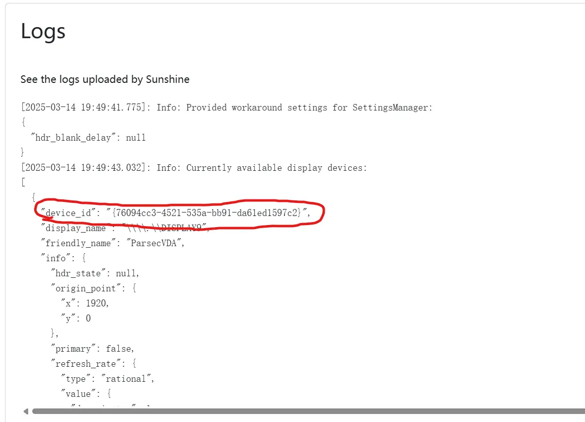

---
tags:
  - 串流
  - Windows
comment: true
---
## 引言

自从在家中添置了显示器，同时在两块屏幕上打开不同的窗口所带来的感觉让我欲罢不能。但是当外出只携带笔记本电脑时，在笔记本自带屏幕上使用分屏就使得本就不富裕的空间雪上加霜。作为一个Windows电脑使用者，看到隔壁Mac OS可以通过随航将iPad当作副屏，我总是会留下嫉妒的泪水，难道Windows就不能将平板当作第二块屏幕吗？经过一番折腾，我找到了一个能够最大化利用平板电脑的屏幕参数的方法，让Windows能用上自己的“随航”（但是体验上还是Mac更无感）。
## 准备工作

使用这种方法首先你需要：
- 一台Windows电脑
- 一台平板电脑，Android或iPad都可
- 一个连接速率足够的局域网
这种方法对于网络连接速率有一定的要求，为了获得最佳体验，最好能使用有线连接或5GHzWiFi网络。
## 软件
### Moonlight
Moonlight是Nvidia GameStream协议的开源实现，后者是Nvidia为其游戏主机Shield开发的串流协议。Nvidia GameStream能够在保证画质的前提下实现毫秒级延迟，但是这一协议只能用于和Shield串流使用。在2013年的MHacks hackathon上，一个来自Case Western Reserve University的团队成功逆向了这一协议，这就是Moonlight。Moonlight可以让我们将PC串流到多个平台上，同时提供了4K、HDR以及最高120FPS的规格。可以在这里找到Moonlight客户端[Moonlight Game Streaming: Play Your PC Games Remotely](https://moonlight-stream.org/)。
### Sunshine
由于Nvidia已经单方面停止了NVIDIA Shield Service支持，目前在Nvidia APP中已经找不到GameStream选项。所以现在更好的解决方法是使用Sunshine作为推流主机。Sunshine是一个为Moonlight提供的开源推流方案，支持使用Nvidia、AMD和Intel GPU硬件解码，同时支持软件解码，这使得非Nvidia GPU用户也能够获得与Nvidia GameStream相似的体验。Sunshine的下载链接在这里[ Releases · LizardByte/Sunshine](https://github.com/LizardByte/Sunshine/releases)。
### ParcelVDisplay
由于Moonlight逻辑的限制（或者这是Windows的限制？），我们不能串流一块不存在的屏幕。这就意味着如果我们需要将扩展内容串流至平板，首先我们需要一块屏幕显示串流内容。而且如果我们想要以平板的原生分辨率进行串流，那么理论上我们需要将一台与平板屏幕规格相同的显示器连接至电脑，这显然很难实现。为了解决这一问题有两种方法，一种是使用虚拟显示器，使用软件创建一个显示器作为扩展，将虚拟显示器串流至平板电脑；另一种方法适用于本来在使用外置显示器情况，多连接一根线材到显示器，欺骗Windows以为自己连接了一个新显示器。本文将主要介绍使用虚拟显示器的方法，第二种方法会进行简单的描述。
在虚拟显示器软件的选择上本文使用[nomi-san/parsec-vdd: ✨ Perfect virtual display for game streaming](https://github.com/nomi-san/parsec-vdd)项目，该项目使用Parcel的虚拟显示驱动程序创建虚拟显示器，并无需额外安装Parcel。Parcel的该驱动程序能够支持生成最高4K和240Hz的虚拟显示器，能够覆盖目前市面上绝大多数屏幕的原生规格。
## 操作步骤
### 1. ParcelVDisplay
在上文链接中下载ParcelVDisplay安装包，项目作者提供了安装版和便携版，在这里我更推荐使用安装版。在成功安装并打开ParcelVDisplay后，可以看到软件主界面:

点击右下角`CUMSTOM...`按钮，输入被当作副屏的平板电脑屏幕参数，我所使用的平板电脑屏幕为2560×1600，120Hz，因此填入软件的槽位1：

点击右下角应用按钮后选择`ADD DISPLAY`便成功生成了虚拟显示器，在Windows系统设置中可以看到系统的确认为电脑上连接了一个分辨率为2560×1600 120Hz的显示器。

>[!caution] 注意
>
>在添加显示器后可能ParsecVDisplay所显示的虚拟显示器参数和正在使用的显示器参数一致，而不是自定义的显示器参数，这可能是投影模式为复制导致的，使用<kbd data-windows-keyboard-key="windows">Win</kbd> + <kbd>P</kbd> 打开投影选项卡选择扩展应该可以解决。

至此，ParsecVDisplay的配置完成。在后续的使用中只需要打开软件直接点击`ADD DISPLAY`按钮即可。
### 2. Sunshine
在上文连接中下载Sunshine安装包，对于Windows系统可选择安装版`sunshine-windows-installer.exe`或携带版`sunshine-windows-portable.zip`，下文以安装版为例。
下载过后正常安装Sunshine，第一次打开Sunshine会出现终端界面：

在浏览器中输入终端提示的Web UI地址。

第一次使用需要设置用户名和密码，**请牢记用户名和密码**。
配置结束后进入Sunshine，可以看到如下界面：

点击`Troubleshooting`选项卡，下拉至Logs部分，找到想要串流的显示器的device_id：

将device_id复制，打开`Configuration`选项卡，选择`Audio/Video`，将先前复制的id粘贴至Display Device Id中，保存并应用：

到此，Sunshine配置完成。后续每次使用时直接打开Sunshine即可。
### 3. Moonlight
首先在平板电脑上下载Moonlight，Android可以在谷歌商店或官网下载，iOS可直接在App Store下载。
保证平板电脑与PC在同一局域网内，打开Moonlight，点击对应电脑选择配对，Moonlight会显示配对码，这时Sunshine会弹出通知：

在打开的网页中输入相应的配对码：

配对成功后网页会出现Success字样。Moonlight会自动跳转至下方的界面，选择Desktop即可将副屏内容串流至平板：

后续使用时只需要在PC上使用ParcelVDisplay添加虚拟显示器，打开Sunshine，便可以直接使用Moonlight进行连接。
至此，你就拥有了一块高刷新率、高分辨率的副屏，Enjoy it! 
## 总结
通过文章中介绍的方法能够很轻松~~并非轻松~~将平板电脑化身一块高素质、不用考虑电源问题的便携屏。同理也可以使用这个方法将PC内容串流到平板，回归Moonlight最本源的用法：串流游戏。希望这篇文章能够帮到你。